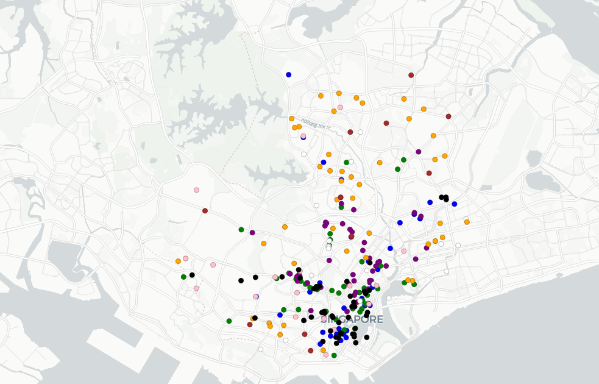
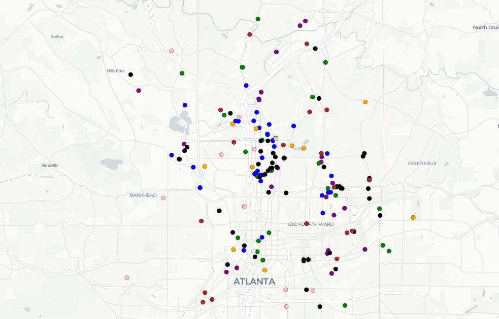
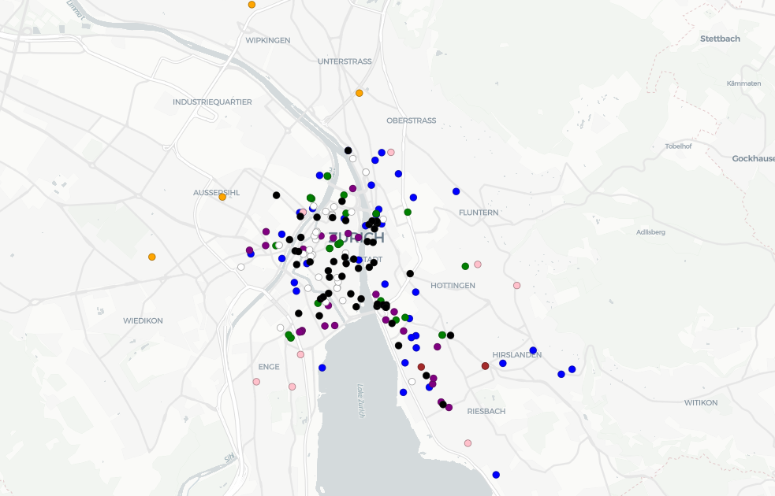

# 
 Querying Foursquare API using MongoDB to Determine Location of New Office Space 
   
  

### Preferred neighbors:
###### ordered by weight
* Other tech companies
  * at least one tech company with at least $1M in revenue
* Starbucks
* Design companies
* Daycares 
* Bars
* Airport 
* Dog groomer 
* Basketball Court

### Cities considered:
* **Singapore** 
* **Atlanta** 
* **Zurich**

  

### Singapore 
 

###### The massive size of Singapore suggests more success in meeting the needs of all employees in a more compact city.  

### Atlanta 

###### While Atlanta is not as large as Singapore, as an American city its businesses are quite spread out. 

### Zurich 

###### Zurich is the perfect size for convenience!  

### Trust Square: [47.3736991,8.5384273]
###### Why Trust Square? 
* With the highest density, there are 95 businesses meeting 4 of our conditions within 500m of the square, including 
  * Starbucks
  * Design Studios
  * Bars and Restaurants
  * Tech companies
* For unmet conditions: 
  * Airport: 
    * Train station 400m from the square brings you to the airport in 20 minutes
  * Daycare: 
    * Located just 600m away
  * Dog groomer: 1.7km (22 min walk)
  * Basketball Courts: 1.6km (20 min walk)

### Neighboring Tech Companies: 
* **New Relic**: net worth of $4.03 billion as of October 30, 2022
* **DealMarket**: More than $1 million in revenue
  * Featured in Crunchbase List: "Financial Services Companies With More Than $1M in Revenue (Top 10K)"
* **Management Digital Data AG**: Information not available. 

